# ElectrodeConv

**Which supplier batch does a battery electrode come from, and what does the difference mean for the cell?**
Explainable quality control for lithium-ion anodes from scanning-electron-microscope images, built over one weekend at
the London AI x Science Hackathon (London Deep Tech Week, 3-4 October 2026) for the materials-manufacturing
track set by Polaron.

Team *losslarp*: Luca Vendruscolo, Adarsh Arun Ganeshbabu, Fivos Papathanasiou, Yasith Medagama Disanayakage
and Jude Popham. Who built what is in [CONTRIBUTORS.md](CONTRIBUTORS.md).

**Demo video:** https://youtu.be/9gRHIVhCxSw

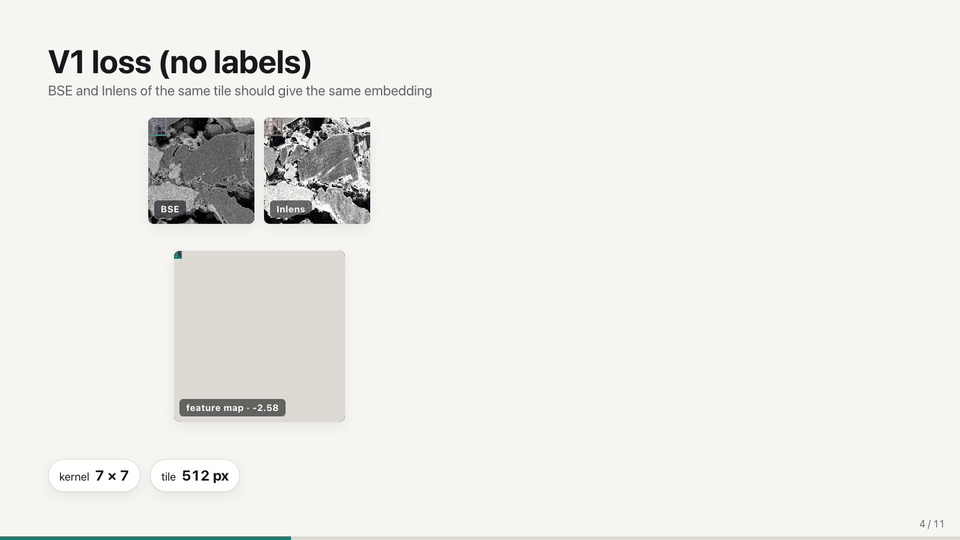

*The first layer of the label-free network scanning one 12.8 µm tile as seen by two detectors. Frames of the
team's animated deck ([demo/](demo/)), drawn from the trained weights.*

## The result in one table

| | |
|---|---|
| Final model | A label-free CNN and a label-trained CNN, joined at the decision and averaged over four training runs |
| Held-out accuracy | **0.71** balanced accuracy on spots the models never saw (90 % interval 0.58 to 0.88; chance 0.33) |
| Judged evaluation set | **5 of 6** images assigned to the right batch, marked by the organisers |
| Earlier 3-image test set | 3 of 3 when told the set holds one image per batch; 2 of 3 without that rule |
| Reads the material, not the microscope | Yes for the label-free model: its embedding groups images by imaging session no more than chance (6 %) |
| Why it matters for a battery | 114 literature questions put to full-text papers; 268 answers kept, each with a quoted sentence found in its paper |

With 31 labelled images every number here has a wide interval, and several things did not work. Both are
reported below.

## The challenge

A battery manufacturer needs to know when an incoming batch of electrode material differs from what the
supplier promised, and in what way, from a handful of microscope images that cost tens of thousands of pounds
to collect. Polaron's brief asked for a system that is interpretable and honest about uncertainty: say which
batch an image belongs to, with a confidence and a reason a materials scientist would accept.

- **The data.** 31 cross-sections of a silicon-graphite anode in three batch folders (7, 7 and 17 images;
  Batch_3 is the baseline). Each spot is 175 µm wide at 25 nm per pixel and was imaged by three detectors at
  once: backscattered electrons (composition), in-lens secondary electrons (fine surface detail) and a
  side-mounted secondary-electron detector (relief).
- **The test.** Assign held-back images to a batch, with a confidence and an explanation.
- **The trap.** Polaron built the batches by cutting about 20 large images into crops and grouping the crops on
  features of their own. Most source images sit entirely in one batch, so a model can score well by
  recognising the *image* (its brightness, noise and framing) and not the material. Polaron called
  overfitting "the crux" of the task.

Full brief, and what Polaron confirmed during the event: [docs/challenge.md](docs/challenge.md).

## 1. Know the data before modelling it

The first finding was about the dataset, not the material. Matching the pixel columns at the edges of every
image showed that 18 of the 31 spots are neighbouring pieces of longer strips, and that three strips run
straight across batch folders.


*One piece of electrode, three batch folders. Polaron confirmed this is how the batches were made.*

That set the rules for everything after it: the unit of independence is the source image ("session"), not
the spot or the tile; a fair test hides a whole session; and the 13 spots from the five sessions that hold more
than one batch are the cleanest test of all, because there the microscope cannot give the batch away.


Code and evidence: [experiments/data_audit/](experiments/data_audit/).

## 2. A bank of frozen features, and an honest null result

Before any network was trained on the images, a bank of frozen features was computed for every crop: phase
fractions and two-point statistics, power spectra, co-occurrence and local binary patterns, orientation
statistics, a Gabor / blob / ridge filter bank, cross-detector statistics, and embeddings from four pretrained
vision models (DINOv2, two DINOv3 backbones and MicroNet). That is 12 families and about 537,000 numbers per
crop, each tagged as *material*, *imaging* or *mixed*, with a contract that forbids a feature from seeing
anything but the pixels.

A kernel classifier, fitted inside each fold with one source image held out at a time, then asked what the
bank knows:

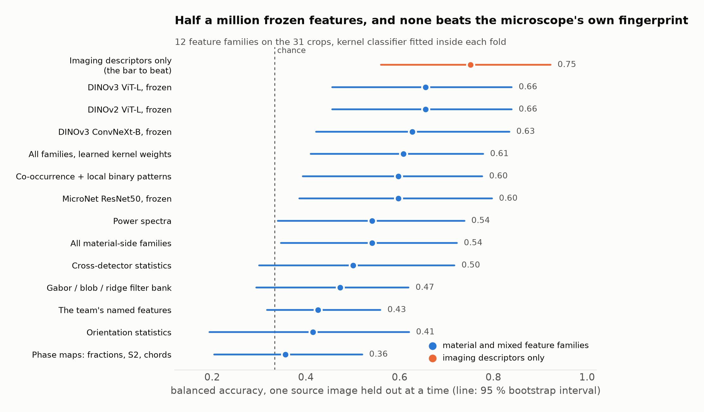

Nothing in the bank beats descriptors of the image acquisition alone (black level, noise, focus). The best
frozen embeddings reach 0.66 against 0.75 for the microscope's own fingerprint. That is the leakage problem
measured directly, and it is why the final model had to be trained on these images and tested for leakage.

Code, contract, leakage tests and results: [feature_bank/](feature_bank/) and
[results/feature_bank/](results/feature_bank/).

## 3. Make the images comparable, then cut them into tiles

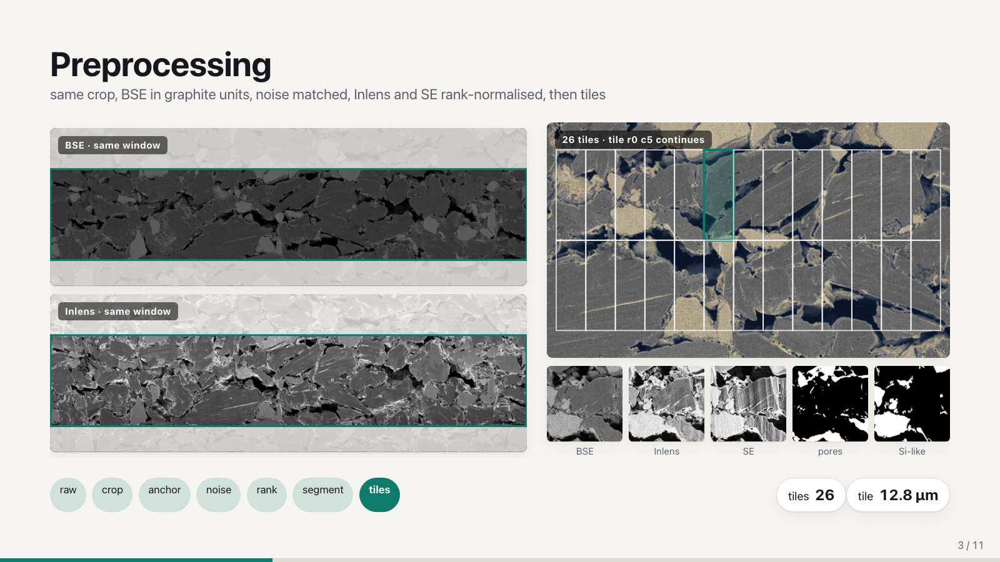

Every image is cropped to the same window, the backscatter channel is rescaled to its own black and graphite
levels, noise is topped up to one common level, and the two secondary-electron channels are rank-normalised.
Image height, black level and noise never reach a model. Each spot then gives 26 tiles of 512 x 512 pixels
(12.8 µm), 806 in all, with a pore mask and a silicon mask from a three-detector segmentation
([segmentation/](segmentation/)).

A check that the preprocessing works is part of the pipeline: after it, image brightness and noise predict the
imaging session at 0.29 where the raw values give 0.71.

## 4. Two networks, two ways of learning

**V1 learns without labels.** One small convolutional encoder (7 x 7 kernels) reads each detector image. It
is trained on two exercises at once: paint each pixel as pore, graphite or silicon, and make the embeddings of
the same tile seen by different detectors agree while differing from every other tile (a cross-detector
contrastive loss). What the detectors share is the material; what differs between them is the instrument.

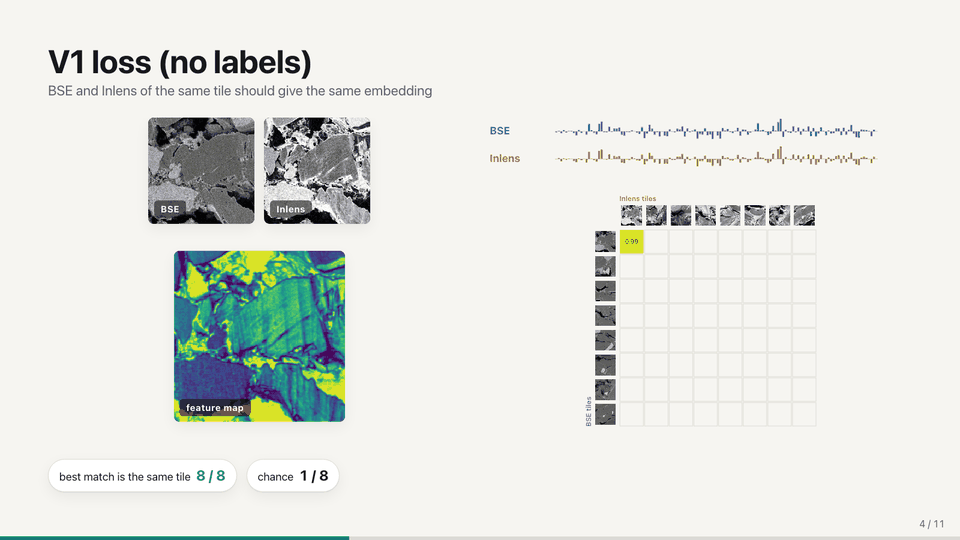

*After training, each backscatter tile is most similar to the in-lens image of the same tile: 8 of 8 in this
example, where chance is 1 in 8.*

**V2 learns from the batch labels.** The three detector images go in together as one three-channel input. A
supervised contrastive loss pulls tiles of the same batch together, pushes other batches apart, and ignores
pairs from the same spot so the network cannot simply learn spot identity.

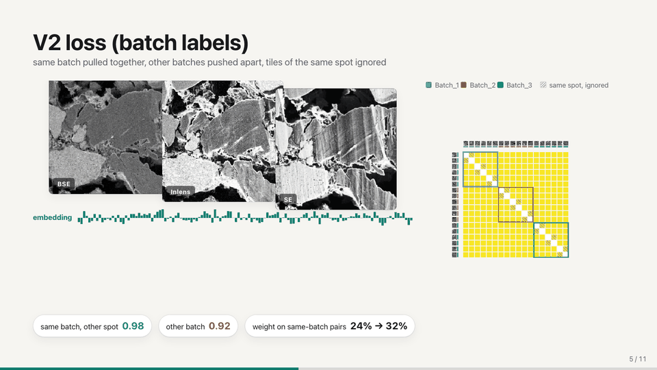

Because V2 sees the labels, it is retrained from scratch for every fold and scored only on spots it never saw.

## 5. Which batch? Results

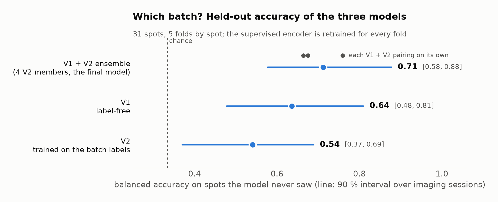

- **V1 alone, 0.64.** Reliable, and its batch signal runs along named material features (22 times more than
  a random direction would), but weak at telling Batch_1 from Batch_2.
- **V2 alone, 0.54.** With 24 training spots per fold it overfits, and its embedding recognises the imaging
  session (a spot's nearest neighbour is from the same session 26 % of the time; chance is 6 %).
- **Joined at the decision, 0.71.** A logistic regression on both descriptions, each standardised and weighted
  equally, averaged over four V2 runs. Training the two as one network was tried and lost the batch signal.

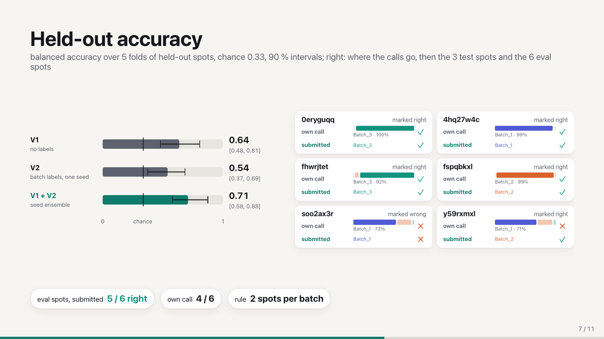

On the six evaluation images released just before judging, the submitted answers were 5 of 6 right. The
model's unconstrained calls were 4 of 6; the fifth came from applying the stated rule that the set held two
images per batch.

### Is it reading the material or the microscope?

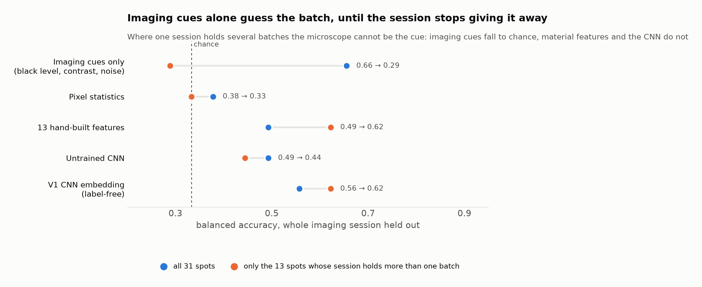

Four numbers describing how each picture was taken guess the batch at 0.66 with a whole session held out.
That is higher than the label-free network on the same test, so the headline score alone proves little. On the
13 spots whose session holds more than one batch, the imaging cues fall to 0.29, below chance, while the
network holds at 0.62. That contrast, on 13 images, is the evidence that the signal is material.

### The embedding

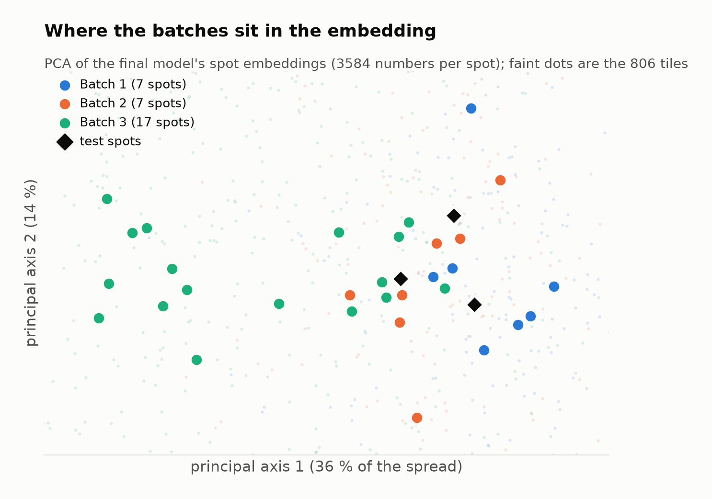

Batch_3 separates; Batch_1 and Batch_2 overlap, which is the pair every model finds hardest. The second half
of this embedding was trained on these labels, so some of the grouping is in-sample.

## 6. A leakage study: seeds and patch size

Two questions about the label-free model, answered with eight training runs on a laptop
([experiments/patch_size_and_seeds/](experiments/patch_size_and_seeds/)): does one run's score hold across
random starts, and does the model still read the material if the hand-made material map is removed from its
training?


- **A single run can land anywhere from chance to 0.7.** Three seeds of the same recipe scored 0.38, 0.50 and
  0.71. Any one number is fragile; the final model averages runs for this reason.
- **Small training patches teach the network the session.** At 128 pixels (3.2 µm, smaller than one graphite
  flake) every model's nearest neighbour came from the same session about 42 % of the time. At 256 pixels
  that fell to 10 % and 26 %; at the 320 pixels used for the team's model it is at the 6 % chance level.
- **Removing the material map did not help.** It looked better on leaky models and lost its lead once the
  leak was controlled: at larger patches the recipe with the material map leaks less and does better on the
  mixed sessions (0.76 against 0.62). The first reading was wrong, and the leak test is what caught it.

## 7. From a feature to a battery outcome

Saying that two batches differ is half the job. The other half is what the difference would do to a cell.

**What each feature looks like.**

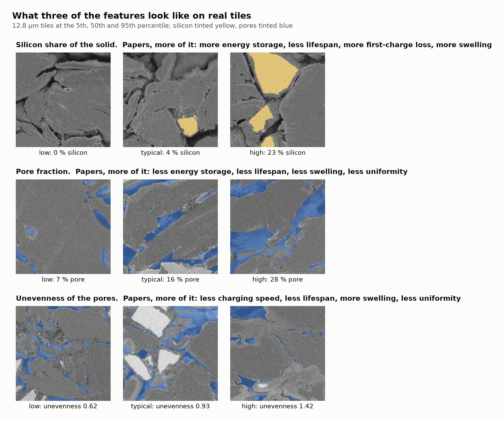

**What the papers say it does.** Every feature and battery outcome is put to the literature as one question,
for example *when electrode porosity is higher, is charging faster or slower?* A paper reader
([GXL Paperclip](https://paperclip.gxl.ai)) opens full-text papers and answers in a fixed schema with one
sentence copied from the paper. An answer is kept only if that sentence is then found in the paper's text.
Directions are counted, never inferred.

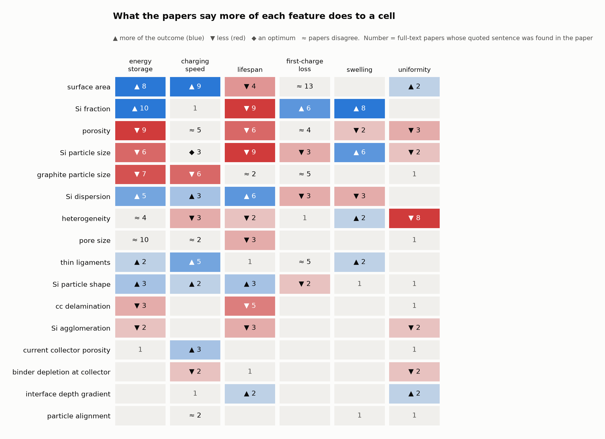

114 questions, 268 answers kept from 159 papers, 44 dropped because the quoted sentence could not be found.
The same counts check the sign of the team's 26 hand-written rules linking features to cell properties: 17
agree, 9 are not settled, none is contradicted.

**What that says about each batch.** The measured shift of each feature from the baseline is multiplied by
the direction the papers agree on. Batch_2 leans better than the baseline, but a sensitivity table shows why:
its lead rests on one clear measurement (a lower silicon fraction, which counts towards less swelling, longer
life and less first-cycle loss). Remove that one feature and no batch leads.
[literature/BATCH_OUTLOOK.md](literature/BATCH_OUTLOOK.md) reports both.

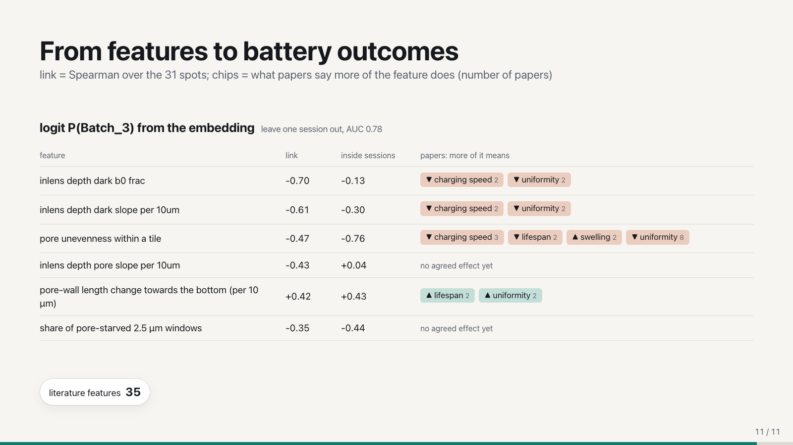

## What did not work

Listed so nobody repeats it; numbers are in [cnn/results/README.md](cnn/results/README.md) and
[results/README.md](results/README.md).

- Half a million frozen features, including four pretrained vision models: none beat imaging descriptors alone.
- A supervised network on its own (0.54): it memorises spot and session.
- Training the label-free and supervised objectives in one network: the batch signal was lost.
- Fine-tuning the label-free encoder with labels, a session-adversarial head, rotations and vertical flips
  (the electrode has a direction), and up-weighting the Batch_1 / Batch_2 pairs.
- Removing the material-map exercise from the label-free model.
- Amass's patent database as a source of industry ranges: it holds battery patents only where they are also
  classified as organic chemistry or medical devices.
- A 2D tortuosity feature: the pores never form a connected path in any of the 31 sections.

## Limits

- **31 images.** One Batch_1 or Batch_2 spot is worth 0.05 of balanced accuracy. Intervals are wide and are
  reported everywhere.
- **The final model's test hides spots, not sessions.** Its supervised half is scored on 5 folds by spot, so
  neighbours of a hidden spot stay in training. The label-free half was also scored with whole sessions held
  out (0.58, p = 0.01) and is the number to trust for a decision.
- **Batches are constructed.** They are groups of crops chosen by Polaron on its own features, not production
  lots, so "which batch is better" is a statement about a kind of microstructure.
- **No electrochemistry.** Every battery outcome here is an expectation from the literature, not a
  measurement on these electrodes.
- **A machine read the papers.** Each quoted sentence is in its paper, but nobody checked that the paper's
  material and conditions match this electrode. Only open-access papers were read.
- **Named features explain a minority of the signal**: about a quarter of the Batch_3 axis and nothing
  reliable for Batch_1 against Batch_2.

## Repository layout

```
data/              the 31 input spots (kept locally, not published) and how to obtain them
preprocessing/     raw images -> session-fair 512 px tiles; the fairness check
segmentation/      three-detector pore / graphite / silicon masks
cnn/               V1 (label-free, cnn/v1/), V2 (supervised contrastive), scoring, leak test, novelty, PCA
models/            embeddings and configs of the five trained encoders (checkpoints kept locally)
qc/                per-feature verdict against the baseline; battery-property rules
ledger/            every feature idea with its papers (verified DOIs) and its result
literature/        feature -> battery-outcome evidence from full-text papers; batch outlook; feature pictures
feature_bank/      the frozen feature bank: contract, 12 families, evaluation harness, leakage tests
experiments/       data audit (strips and sessions); seeds and patch-size study
dashboard/         the team page: one spot walked through the pipeline, then the results
demo/              the animated judging deck
results/           headline numbers and an index of every result file
docs/              the brief, figure scripts and figures
```

## Run it

```bash
pip install -r requirements.txt                 # Python 3.10+, PyTorch 2.x (CUDA, Apple MPS or CPU)

python preprocessing/preprocess.py              # data/Batch_*/ -> tiles (about 4 min, 1.6 GB)
python preprocessing/check_fairness.py          # does any session cue survive?
python cnn/v1/train.py --name v1 --crop 320 --batch 24 --epochs 30    # the label-free model (GPU); --minutes 10 on a laptop
python cnn/v1/embed.py --name v1
python cnn/supcon.py run --name v2 --gpu 0      # the supervised model: 5 held-out folds + the full model
python cnn/compare.py --v2 v2                   # V1, V2 and the two joined, on the same folds
python cnn/classify.py --dir /path/to/images    # batch, probability and stability for new spots
python cnn/novelty.py --run v1                  # does a new spot look like any training batch at all?

python literature/evidence.py                   # feature x outcome questions -> counted, quoted evidence
python literature/batch_outlook.py              # measured shifts x paper directions
python docs/make_figures.py                     # the charts in this README
open dashboard/site/index.html                  # the team page
open demo/index.html                            # the deck (arrow keys)
```

Trained embeddings are in `models/`, so `cnn/pca_plot.py`, `cnn/compare.py`, the page and the deck work from a
fresh clone without a GPU. The input images and model checkpoints are not in the repository; see
[data/README.md](data/README.md) and [models/README.md](models/README.md).

## Credits

- **Data and challenge:** Polaron (Steve Kench and the Polaron team), London AI x Science Hackathon.
- **Literature:** [Amass](https://amass.tech) BiomedCore search and [GXL Paperclip](https://paperclip.gxl.ai)
  search and paper reader, both on hackathon credits. A side-by-side test of the two is in
  [ledger/papers/](ledger/papers/).
- **Compute:** [Modal](https://modal.com) for the feature bank's cloud runs.
- **Pretrained models (feature bank only):** DINOv2 and DINOv3 (Meta AI), MicroNet (NASA).
- **Libraries:** PyTorch, scikit-learn, scikit-image, NumPy, SciPy, pandas, Pillow, matplotlib, timm, kymatio,
  PoreSpy, GUDHI, mahotas, TauFactor.
- **Methods:** supervised contrastive learning (Khosla et al., 2020); NT-Xent (Chen et al., 2020).
