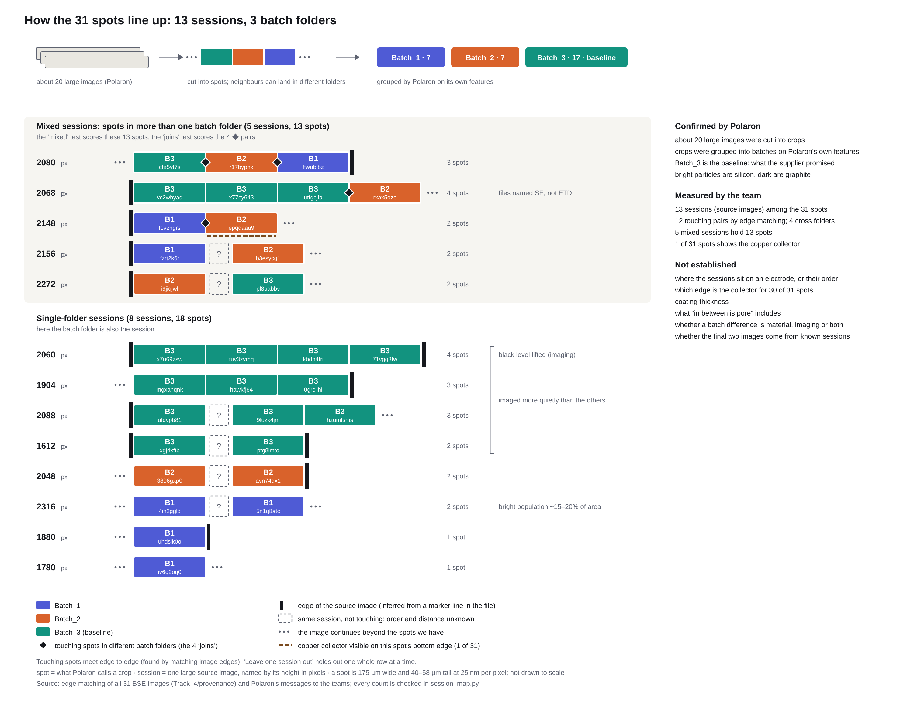
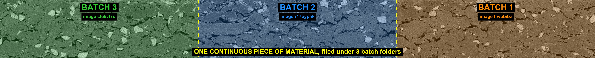

# Data audit: the 31 spots are pieces of longer strips, and the strips cross batch folders

Done in the first hours of the event, before any model. It changed what counted as an independent sample and set
the team's held-out tests.

## What was found

| Finding | Evidence |
|---|---|
| 18 of the 31 spots join edge to edge with a neighbour (12 joins) | The last pixel columns of one image against the first of the next: joined pairs score 0.83 to 0.97, 80 random pairs average 0.10 with a maximum of 0.49 |
| 4 of the 12 joins cross batch folders, on 3 strips | Same test: 0.89 to 0.92. One strip is filed as Batch_3, Batch_2 and Batch_1 |
| The 31 spots come from 13 source images | Spots that share an image height also share an identical resolution tag; two same-height, mixed-folder pairs do not touch (0.03 to 0.23) |
| 13 files carry a thin marker line in the green channel at one edge | It marks the end of a source image; read channel 0 only |
| Four Batch_3 spots have a raised black level | An imaging setting, not a material difference: a fixed threshold reads their pore fraction five times too low |
| No pore path crosses any section | Under three pore definitions the largest connected pore cluster spans 20 to 36 % of the thickness, so a 2D tortuosity solve returns nothing |

Polaron confirmed the cause: about 20 large images were cut into crops, and the crops were grouped into batches
on Polaron's own features.

## Why it mattered

- **The unit is the source image.** Tiles of one spot, and spots of one strip, are not independent. Splitting by
  tile or by spot puts pieces of one strip on both sides of a test.
- **Imaging settings follow the source image**, and most source images sit in one batch. A model can therefore
  guess the batch from brightness and noise. Four imaging numbers alone score 0.66.
- **The mixed sessions are the clean test.** Five sessions hold more than one batch (13 spots). There the imaging
  cannot be the cue, and those 13 spots became the team's "mixed" score.

## Files

| File | What it is |
|---|---|
| `strip_map.csv` | Every spot: batch folder, source image, neighbours, edge-match score, intensity percentiles |
| `session_map.png`, `session_map.py`, `session_map.md`, `spots_table.csv` | The map above, the script that draws it, and its sources |
| `seam_examples/` | Eleven pictures: the three cross-folder strips, close-ups of the four cross-folder joins, two ordinary joins, and two pairs that do not join, with the numbers in its README |

