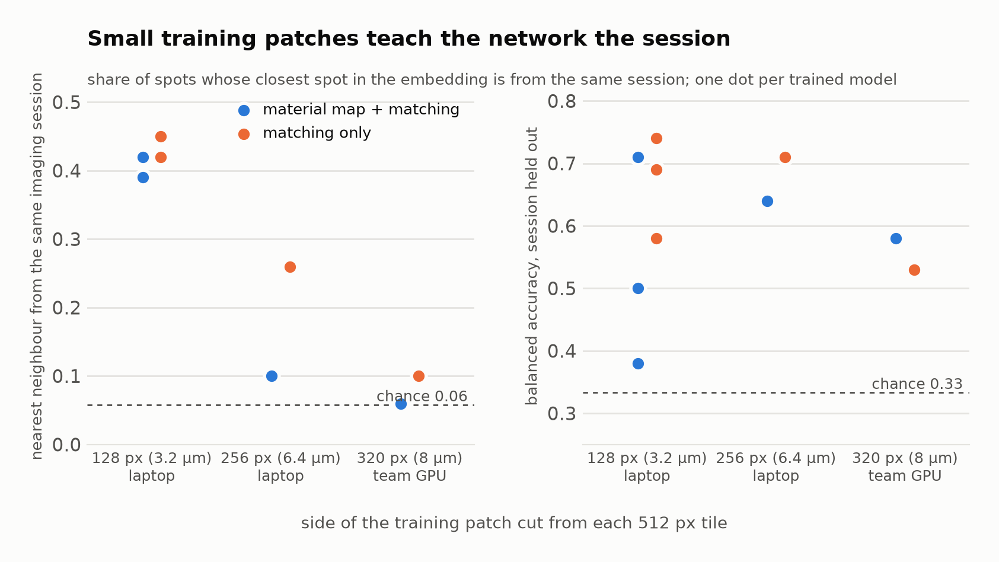

# Seeds and patch size: is the label-free model's score stable, and what is it reading?

Eight training runs of the label-free model (`cnn/v1/train.py`) on an Apple M4 Pro laptop, about three and a half
hours, run on the second morning of the event. Two questions:

1. **Stability.** The team's model was one training run. Does the score hold across random seeds?
2. **The material map.** Half of the model's training signal is a per-pixel pore / graphite / silicon map that was
   made, at that point, by brightness thresholds. Does the model do as well trained on cross-detector matching
   alone?

```bash
bash experiments/patch_size_and_seeds/run.sh
python experiments/patch_size_and_seeds/score_with_leak.py "exp_*"
```

## Results

`scores_with_leak.txt`, written by `score_with_leak.py`. Chance: accuracy 0.33, same-session neighbour 0.06,
session guessable 0.09.

| Recipe | Patch | Seed | Session held out | Mixed sessions | Nearest neighbour from the same session | Session guessable |
|---|---|---|---|---|---|---|
| Material map + matching | 128 px | 0 | 0.50 | 0.44 | 0.42 | 0.38 |
| Material map + matching | 128 px | 1 | 0.38 | 0.38 | 0.42 | 0.35 |
| Material map + matching | 128 px | 2 | 0.71 | 0.62 | 0.39 | 0.42 |
| Matching only | 128 px | 0 | 0.69 | 0.44 | 0.45 | 0.55 |
| Matching only | 128 px | 1 | 0.74 | 0.62 | 0.45 | 0.47 |
| Matching only | 128 px | 2 | 0.58 | 0.49 | 0.42 | 0.31 |
| Material map + matching | 256 px | 0 | 0.64 | 0.76 | 0.10 | 0.20 |
| Matching only | 256 px | 0 | 0.71 | 0.62 | 0.26 | 0.17 |

For reference, the team's GPU runs at 320 px patches (`cnn/results/v1_variants.md`): material map + matching 0.58
with a same-session rate of 0.06; matching only 0.53 with 0.10.



## What it shows

- **One run is not a result.** The same recipe at three seeds scored 0.38, 0.50 and 0.71. The final model averages
  several runs for this reason.
- **Small patches teach the network the imaging session.** A 128 px patch is 3.2 µm, smaller than one graphite
  flake, so the network sees fine texture and noise, which is where a session's fingerprint lives. In all six
  128 px models a spot's nearest neighbour came from the same session about 42 % of the time (chance 6 %). At
  256 px that fell to 10 % and 26 %, and at 320 px it is at chance.
- **Matching only is not better.** At 128 px it scored higher on average (0.67 against 0.53), and that was first
  read as a win. Every one of those models leaks. At 256 px the recipe with the material map leaks less (10 %
  against 26 %) and does better where the session cannot help (0.76 against 0.62 on the mixed sessions). The
  team's GPU runs agree.

The practical outcome: the team kept its recipe and its large patches, and the session-leak test became a column
in every score table.

## Limits

One seed per recipe at 256 px. The mixed-session score is 13 spots. The patch-size explanation is consistent with
three patch sizes but batch size and hardware also differ between the laptop and GPU runs.

## Notes on the scripts

The runs were made with the team repository at the commit of 4 October, 05:08; run names here are `exp_*`. The
256 px material-map run needs more GPU memory than the training script's laptop cap allows (the first attempt ran
out at epoch 6), so `run.sh` raises the cap for that run only.
